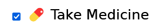
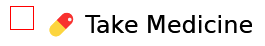
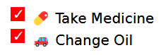

Recently, while I was working on my [Simple Todo App](https://chrisleggett.me/portfolio/todo-vite-ts), I had the need to style a checkbox. This turned out not to be a trivial process. Once I got it figured out, I decided to write this blog post, both to solidify my knowledge and share this with anyone else who happens upon this issue.

Imagine you have the following HTML on your page.

```html
<label class="checkbox-label">
  <input type="checkbox" class="checkbox">
  <span>💊 Take Medicine</span>
</label>
```

Imagine you wanted the checkbox to be filled in with red instead of blue when you check the box. You might imagine that you could style the checkbox with some simple CSS such as the following.

```css
.checkbox:checked {
  background-color: red;
}
```



Unfortunately it's not quite that simple. You can apply some styles directly to the checkbox, such as sizing, margin, padding, etc. However if you want to use a different symbol or change the color of the textbox, you have to get a bit more creative than that. Essentially, what we have to do is not display the checkbox at all and fill in the blanks with our custom styles.

First, the styling for the checkbox in its normal state:

```css
  .checkbox {
    appearance: none;
    cursor: pointer;
    border: 1px solid red;
    width: 1rem;
    height: 1rem;
```

- `appearance: none`: this effectively removes the default checkbox but leaves the functionality.
- `cursor: pointer`: this controls what the cursor looks like while the checkbox is moused over. We set it to `pointer` in order to signify that our custom checkbox is clickable.
- `border: 1px solid red`: This sets a border around the checkbox so that we can visually see it, otherwise it's invisible. Feel free to customize any part of this you wish to make it appear how you want it.
- `width` and `height`: These need to be specified, or else the custom checkbox will have no size, and the borders will appear as a tiny dot on the screen.



You can also specify some additional styling here if you wish, such as `border-radius` and `transition-duration` (to fade in the checked background color), if you would like.

The next step is to style the `checked` state of the checkbox. This is pretty simple.

```css
.checkbox:checked {
  background-color: red;
}
```


Then you get a nice red background color when the checkbox is checked. Simple as that! But there's no checkmark symbol! This is where it starts to get a bit complicated again.

First off, you need to make sure the *parent* of the checkbox and span tag has a position of `relative`. In my case, this is the element with the class of `checkbox-label`.

```css
.checkbox-label {
  postion: relative;
}
```

Next, you need to apply the following styles to the `checkbox`'s sibling `span` tag with the `before` psuedo-attribute:

```css
.checkbox:checked + span::before {
  content: '\2713';
  color: white;
  position: absolute;
  left: 0.35rem;
  top: -0.3rem;
  cursor: pointer;
}
```

The `position: absolute` here is why the `position: relative` was needed on the parent. Let's go over these

- `content: '\2713'`: This adds the checkmark symbol.
- `color: white;`: Makes the checkmark white, supply a different color if you wish.
- `cursor: pointer`: same as earlier, just applied to the checkmark itself this time.
- `position: absolute`: Since we are technically applying this style to the span tag that is after the checkbox, we need some absolute positioning in order to move the checkmark inside the checkbox. Depending on any sizing, margins, flex layout, etc that you may have applied to the checkbox or its parents or siblings, you may need to adjust the `top` and `left` properties a bit. There's no exact science here, just fiddle with them until the checkmark is in the middle of the box.


And just to prove it works with multiple checkboxes and not just because the checkbox is at the top of the page in this contrived example, consider the following HTML with the same CSS.

```html
<ul>
  <li>
    <label class="checkbox-label">
      <input type="checkbox" class="checkbox">
      <span>💊 Take Medicine</span>
    </label>
  </li>
  <li>
    <label class="checkbox-label">
      <input type="checkbox" class="checkbox">
      <span>🚗 Change Oil</span>
    </label>
  </li>
</ul>
```

This results in the following:



And there you have it! The absolute positioning required is a bit unfortunate, so make sure if you add any padding or margins to surrounding elements that you revisit that to make sure the checkmark is still in the middle. If you used `rem` like I did, then font-size changes on any parent tags shouldn't knock the checkbox too far out of the middle, at least until you make pretty significant changes. If you do need to drastically increase your font-size, you may want to replace the hard-coded `rem` values with [CSS Custom Properties](https://developer.mozilla.org/en-US/docs/Web/CSS/--*) and change them wherever you change the font size.

For the complete example, check out the [Codepen](https://codepen.io/leggettc18/pen/bGayPzo). There may be smoother ways of accomplishing this, so I'd be interested in hearing from you if you know of a better one! Feel free to hit me up on Twitter [@leggettc18](https://twitter.com/leggettc18)! I'll update the blog post with anything useful.

