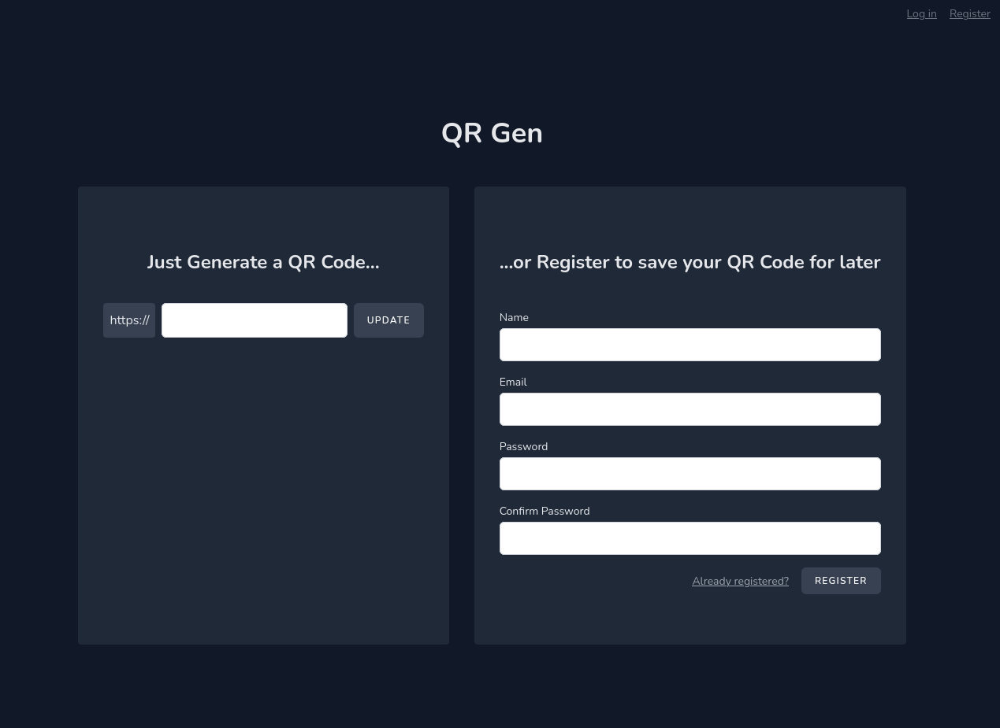

QR-Gen is a simple web-app I built with Laravel 9, Inertia, and VueJS. A demo for it can be found at [demo.qrgen.leggett.dev](https://demo.qrgen.leggett.dev). This is a demo, so don't put anything sensitive there and don't expect the data to be persistent forever.

The premise of the app is simple. You can use it to generate QR Codes and download the generated image. You can then share that image anywhere you'd like. For example, below is the QR Code generated for the demo site I linked above. The app is essentially minimally feature complete, but there are definitely some polish and quality of life changes I'd like to do down the road.

In addition to enabling you to generate a QR Code and download it on the fly, you can also create an account to perform all the basic <abbr title="Create, Read, Update, and Destroy">CRUD</abbr> actions. Such as saving the QR Code for later, or edit the name or the link it points to, or even delete it from your account. This is where Laravel comes in. This app is a rather basic use of Laravel, but there is at least some use of the less trivial features, such as validation and guarding routes behind authentication.

Eventually, I'd like to add a more robust login system, perhaps utilizing Auth0 or Clerk, the ability to save other types of data in the QR Codes, and the ability to share the images directly to various social media platforms. Currently they are required to be downloaded and manually uploaded. These are all coming as soon as time allows.