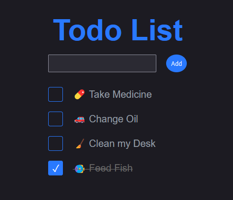

# Todo App - Vanilla TS Vite Stack
This is a basic todo app written in Vanilla [TypeScript](https://www.typescriptlang.org/), bundled with [Vite](https://vitejs.dev/) using the vanilla-ts template preset. The goal of this project is to demonstrate my ability to work with vanilla HTML5, CSS3, and TypeScript (and by extension JavaScript, since I could just remove the types and it would be valid vanilla JavaScript). I realized that all my other apps used some kind of front-end framework, so I made this to check the fundamentals off the list, so to speak.

The app is fairly feature lite. Tasks are simple, having just an id, name, completed status, and created date. They are stored in the browser's `localStorage`, so they persist across refreshes but not between browsers. I added some visual flair to demonstrate my CSS3 skills, such as a [custom checkbox](https://chrisleggett.me/blog/css-style-checkboxes) and color change transitions. It utilizes [CSS Custom Properties](https://developer.mozilla.org/en-US/docs/Web/CSS/--*) to keep the color-scheme consistent. It also has a dark mode on supported browsers thanks to the [color-scheme](https://developer.mozilla.org/en-US/docs/Web/CSS/color-scheme) meta tag (plus a few custom dark styles). 

I'll be hacking on this occasionally to see how far I can take this with just vanilla HTML5, CSS3, and TypeScript. A non-exhaustive list of some improvements I had in mind are: 
- Attempting to make flashier animations when possible.
- Subtasks.
- Due dates with in-page reminders.
- Multiple color schemes.

This is not intended to be a super useful todo app, moreso a playground for me and quick demonstration of skills.

As with most of my other projects, it uses [VSCode Dev-Containers](https://code.visualstudio.com/docs/remote/create-dev-container) to make it easy to run and develop on this project on any computer that has VSCode and Docker. No local dependencies needed (not that this app has many)!

Feel free to play around with the demo at [https://todo.leggett.dev](https://todo.leggett.dev/).

Proficiencies Demonstrated:
 - HTML5
 - CSS3
   - Animations
   - Custom Properties/Variables
 - TypeScript/JavaScript
 - Vite/Build Tools